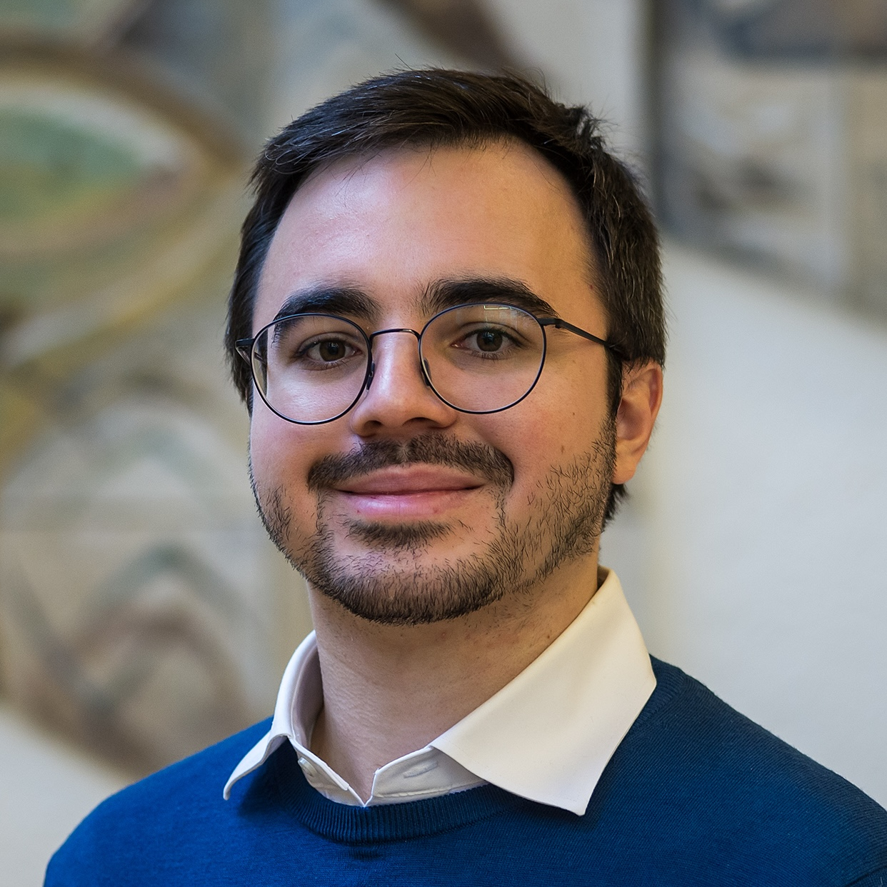

```{=html}
<h2>Course coordinators</h2>

<div class="grid-container">
  <div class="profile">
    <div class="main-container">
      <div class="image-container">
        
      </div>
      <div class="text">
        <h3>Stephan Dietrich</h3>
        <p class="subtitle">Economics, Assistant Professor, Maastricht University & United Nations University - MERIT</p>
        <div class="icons-container">
          <a href="https://www.linkedin.com/in/stephan-dietrich-data/?originalSubdomain=nl" target="_blank"><i style = "color:#204eb6;" class="bi bi-linkedin "></i></a>
          <a href="https://unu.edu/merit/about/expert/dr-stephan-dietrich" target="_blank"><i class="bi bi-globe2"></i></a>
        </div>
        <a class="expand" href="#" onclick="toggleDescription(this); return false;">+ info</a>
      </div>
    </div>
    <p class="description">
      Stephan researches the use of data in public policy making, focusing on validating existing approaches to
      measure
      and utilize data for policy design and implementation. This includes verifying that automated decision-making
      systems are unbiased and fair, and ensuring that food security assessments based on national statistics are
      accurate. His work also explores new approaches to measure phenomena relevant to policy design and assessment,
      such as using subjective well-being data to measure global warming damages and applying social sensing tools for
      remote polling of preferences and opinions. He is particularly interested in applications involving food prices
      and insurance mechanisms in food insecure regions, targeting of social policies, and taxation. As an academic
      lecturer, Stephan teaches courses at the Master's and PhD level, including introductory data science and machine
      learning for public policy.
    </p>
  </div>

  <div class="profile">
    <div class="main-container">
      <div class="image-container">
        
      </div>
      <div class="text">
        <h3>Michelle González Amador</h3>
        <p class="subtitle">Economics, Postdoctoral researcher, Wageningen University & Research</p>
        <div class="icons-container">
          <a href="https://www.m-gonzalezamador.com/" target="_blank"><i class="bi bi-globe2"></i></a>  <a
            href="mailto:michelle.gonzalezamador@wur.nl" target="_blank" title="michelle.gonzalezamador@wur.nl"><i class="bi bi-envelope"></i></a>  <a
            href="https://github.com/michelleg06" target="_blank"><i class="bi bi-github"></i></a>  <a
            href="https://www.linkedin.com/in/michelle-gonzalez-amador06/?originalSubdomain=nl"
            target="_blank"><i style = "color:#204eb6;" class="bi bi-linkedin "></i></a>
           <a href="https://bsky.app/profile/michelleg06.bsky.social" target="_blank"><i class="bi bi-bluesky"></i></a>
        </div>
        <a class="expand" href="#" onclick="toggleDescription(this); return false;">+ info</a>
      </div>
    </div>
    <p class="description">
      Michelle is a postdoctoral researcher at Wageningen University's Economic Research Institute, specializing in
      complex socioeconomic systems and human capital investment. She employs econometric, algorithmic, and
      experimental
      methods to study how people interact in and with unequal systems, technology, and education. Her research is
      primarily driven by informing the design and implementation of public policies. Michelle co-organizes the <a
        href="https://bridges.eaamo.org/" target="_blank">EAAMO-Bridges</a> Summer of Science program for indigenous
      women in Latin America and has consulted for the World Bank, International Labour Organization, and Maastricht
      University. Her research interests include causal inference econometrics, machine learning for social good,
      social
      network analysis, and economic development.
    </p>
  </div>
</div>

<!-- LECTURERS -->

<h2>Lecturers</h2>

<div class="grid-container">
  <div class="profile">
    <div class="main-container">
      <div class="image-container">
        
      </div>
      <div class="text">
        <h3>Francisco Rosales</h3>
        <p class="subtitle">Founder and CEO @ Center For Advanced Analytics | Ph.D. in Mathematics</p>
        <div class="icons-container">
          <a href="https://www.linkedin.com/in/fraroma/" target="_blank"><i style = "color:#204eb6;" class="bi bi-linkedin "></i></a>
        </div>
        <a class="expand" href="#" onclick="toggleDescription(this); return false;">+ info</a>
      </div>
    </div>
    <p class="description">
      With over two decades of professional experience, I am at the helm of Center For Advanced Analytics, committed to
      innovating in the field of data science. My core competencies lie in developing analytical models and leveraging
      the power of machine learning to drive strategic decisions. At Center For Advanced Analytics, my mission is to
      merge the rigorous discipline of mathematics with cutting-edge analytics to provide unique insights, aligning with
      the organization’s dedication to excellence and transformative impact.

      Since my appointment as Director at ESAN Graduate School of Business, I have directed both the Data and Analytics
      Diploma and the Data Science Undergraduate Program, fostering the next generation of analytics experts. My role
      involves guest lecturing at Maastricht University, where I apply practical knowledge of tidyverse and MLflow tools
      to instill machine learning competencies for public policy applications. This recent experience reflects my
      ability to navigate the academic and business landscapes, equipping students and professionals alike with the
      skills to excel in the analytics domain.
    </p>
  </div>

  <div class="profile">
    <div class="main-container">
      <div class="image-container">
        
      </div>
      <div class="text">
        <h3>Juba Ziani</h3>
        <p class="subtitle">Assistant Professor in ISyE at Georgia Tech</p>
        <div class="icons-container">
          <a href="https://www.linkedin.com/in/jubaziani/" target="_blank"><i style = "color:#204eb6;" class="bi bi-linkedin "></i></a>
          <a href="https://sites.gatech.edu/juba-ziani/" target="_blank"><i class="bi bi-globe2"></i></a>
        </div>
        <a class="expand" href="#" onclick="toggleDescription(this); return false;">+ info</a>
      </div>
    </div>
    <p class="description">
      I am an Assistant Professor in the School of Industrial and Systems Engineering at Georgia Tech and a recipient of
      the NSF CAREER Award. My research and my students have also been supported by NSF Award IIS-2504990, a Structural
      Democracy Fellowship from Moon Duchin’s MGGG lab, an internal IPAT grant, and internal BBISS Sustainability Next
      Seed grant, and an internal ARC-ACO Student Fellowship.

      My research lies at the intersection of Computer Science, Operations Research, and Economics. I use tools from
      learning theory, game theory, and optimization to address technical and societal challenges arising from the rise
      of AI, ML, and data-driven decision making.
    </p>
  </div>

  <div class="profile">
    <div class="main-container">
      <div class="image-container">
        
      </div>
      <div class="text">
        <h3>Robin Cowan</h3>
        <p class="subtitle">Professor of the Economics of Technical Change at the University of Maastricht</p>
        <div class="icons-container">
          <a href="https://cowan.unu-merit.nl/" target="_blank"><i class="bi bi-globe2"></i></a>
        </div>
        <a class="expand" href="#" onclick="toggleDescription(this); return false;">+ info</a>
      </div>
    </div>
    <p class="description">
      He began his official affiliation with the UNU Maastricht Economic and Social Research and Training Institute on
      Innovation and Technology (UNU-MERIT) in 1996 as a Professorial Fellow. He studied at Queen's University in Canada
      and at Stanford University where he received a Ph.D. in economics and an M.A. in philosophy. Robin Cowan was
      Assistant Professor of Economics at the University of Western Ontario until 1998. His current research has
      includes several topics: the changing economics of knowledge; social networks and innovation; network structure
      and network performance; dynamics of consumption and social status; interacting agents models. In the past he has
      done consulting research for the OECD on the economics of standards, the European Commission on innovation policy,
      and the National Renewable Energy Laboratory on technological lock-in and renewable energy technologies. In 2004
      he won one of 15 prestigious Chaires d'Excellence of the Ministry of research and Education in France. Robin Cowan
      is also an adjunct professor at the Economics Department at the University of Waterloo, Ontario, Canada.
    </p>
  </div>
</div>

  <h2>Assistants</h2>

<div class="grid-container">
  <div class="profile">
    <div class="main-container">
      <div class="image-container">
        
      </div>
      <div class="text">
        <h3>Lucas Boh</h3>
        <p class="subtitle">Project Coordinator and Research Assistant at UNU-MERIT</p>
        <div class="icons-container">
          <a href="https://www.linkedin.com/in/lucas-boh-405770169/" target="_blank"><i style = "color:#204eb6;" class="bi bi-linkedin "></i></a>
          <a href="https://lucasboh.com" target="_blank"><i class="bi bi-globe2"></i></a>
        </div>
        <a class="expand" href="#" onclick="toggleDescription(this); return false;">+ info</a>
      </div>
    </div>
    <p class="description">
      Lucas holds a Bachelor’s degree in Media Technology from the Düsseldorf University of Applied Sciences and completed
      a Master’s in Public Policy and Human Development at UNU-MERIT in 2024, specializing in social protection
      policies. His thesis explored the relationship between agricultural expansion and real estate tax revenues in
      Paraguay.
    </p>
  </div>
</div>
```

```{=html}
<style>
  .grid-container {
    display: grid;
    grid-template-columns: 1fr;
    gap: 16px;
    align-items: flex-start;
  }

  .profile {
    padding: 16px 23px;
    border-radius: 24px;
    box-shadow: 0px 2px 6px rgba(0, 0, 0, 0.15);
  }

  .profile .main-container {
    display: flex;
    gap: 16px;
  }

  .profile h3 {
    margin-top: 0;
    font-size: 24px;
    margin-bottom: 4px;
  }

  .profile .subtitle {
    padding-top: 6px !important;
    line-height: 134%;
    font-size: 18px;
  }

  .profile .image-container {
    max-width: 112px;
    min-width: 112px;
  }

  .profile .image-container img {
    border-radius: 50%;
    display: block;
    width: 100%;
  }

  .profile .subtitle {
    font-style: italic;
  }
  
  .profile .icons-container {
    display: flex;
    gap: 8px;
    margin-bottom: 16px;
  }

  .expand {
    color: #204EB6;
    cursor: pointer;
    margin-bottom: 8px;
    display: block;
    text-decoration: none;
    transition: opacity 0.2s ease;
    margin-bottom: 10px;
  }

  .expand:hover {
    opacity: 0.8;
  }

  .profile .description {
    padding-top: 18px;
    border-top: 1px solid rgba(0, 0, 0, 0.1);
    transition: max-height 0.3s ease, opacity 0.3s ease, padding 0.3s ease;
    overflow: hidden;
    max-height: 0;
    opacity: 0;
    padding-top: 0;
    border-top: none;
    margin:0;
  }

  .profile .description.expanded {
    max-height: 650px;
    opacity: 1;
    padding-top: 18px;
    border-top: 1px solid rgba(0, 0, 0, 0.1);
  }

  @media screen and (min-width: 600px) {
    .grid-container {
      grid-template-columns: 1fr 1fr;
      row-gap: 40px;
    }

    .profile .image-container {
      min-width: 112px;
    }
  }
</style>

<script>
  function toggleDescription(link) {
  // Find the profile container
  const profile = link.closest('.profile');
  
  // Find the description paragraph within this profile
  const description = profile.querySelector('.description');
  
  // Toggle the expanded class
  if (description.classList.contains('expanded')) {
    description.classList.remove('expanded');
    link.textContent = '+ info';
  } else {
    description.classList.add('expanded');
    link.textContent = '- hide';
  }
}
</script>
```
