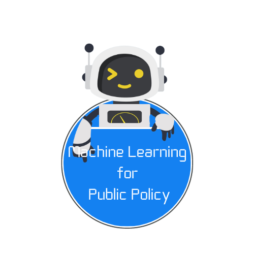

{fig-align="center" width="380"}

```{=html}
    <div class="code-container">
        <!-- Python Code Block -->
        <div class="code-block">
            <div class="language-indicator">Python</div>
            
            <div id="python-content">
                <div class="code-line"><span class="comment"># Machine Learning Introduction</span></div>
                <div class="code-line"><span class="keyword">import</span> pandas <span class="keyword">as</span> pd</div>
                <div class="code-line"><span class="keyword">import</span> numpy <span class="keyword">as</span> np</div>
                <div class="code-line"><span class="keyword">import</span> skimpy</div>
                <div class="code-line"><span class="keyword">from</span> sklearn.model_selection <span class="keyword">import</span> train_test_split</div>
                <div class="code-line"><span class="keyword">from</span> sklearn.ensemble <span class="keyword">import</span> <span class="animated-content"><span class="typing-text function" id="python-typing"></span><span class="cursor"></span></span></div>
            </div>
        </div>

        <!-- R Code Block -->
        <div class="code-block">
            <div class="language-indicator">R</div>
            
            <div id="r-content">
                <div class="code-line"><span class="comment"># Machine Learning Introduction</span></div>
                <div class="code-line"><span class="function">library</span>(caret)</div>
                <div class="code-line"><span class="function">library</span>(tidyverse)</div>
                <div class="code-line"><span class="function">library</span>(skimr)</div>
                <div class="code-line"><span class="function">library</span>(<span class="animated-content"><span class="typing-text function" id="r-typing"></span><span class="cursor"></span></span>)</div>
            </div>
        </div>
    </div>

    <script>
        // ML algorithms/libraries to cycle through
        const pythonLibraries = [
            'RandomForestClassifier',
            'LogisticRegression', 
            'SVM',
            'GradientBoostingClassifier',
            'XGBClassifier',
            'LGBMClassifier',
            'CatBoostClassifier',
            'DecisionTreeClassifier',
            'KNeighborsClassifier',
            'GaussianNB'
        ];

        const rLibraries = [
            'randomForest',
            'xgboost', 
            'glmnet',
            'rpart',
            'neuralnet',
            'kernlab',
            'gbm',
            'nnet',
            'class'
        ];

        let pythonIndex = 0;
        let rIndex = 0;

        function typeText(text, element, speed = 80) {
            return new Promise((resolve) => {
                element.textContent = '';
                let i = 0;
                
                const typeInterval = setInterval(() => {
                    if (i < text.length) {
                        element.textContent += text.charAt(i);
                        i++;
                    } else {
                        clearInterval(typeInterval);
                        resolve();
                    }
                }, speed);
            });
        }

        function deleteText(element, speed = 40) {
            return new Promise((resolve) => {
                const text = element.textContent;
                let i = text.length;
                
                const deleteInterval = setInterval(() => {
                    if (i > 0) {
                        element.textContent = text.substring(0, i - 1);
                        i--;
                    } else {
                        clearInterval(deleteInterval);
                        resolve();
                    }
                }, speed);
            });
        }

        async function animatePython() {
            const typingElement = document.getElementById('python-typing');
            const currentLibrary = pythonLibraries[pythonIndex];
            
            // Type the library name
            await typeText(currentLibrary, typingElement, 70);
            
            // Pause
            await new Promise(resolve => setTimeout(resolve, 2500));
            
            // Delete the library name
            await deleteText(typingElement, 30);
            
            // Move to next library
            pythonIndex = (pythonIndex + 1) % pythonLibraries.length;
            
            // Small pause before next iteration
            await new Promise(resolve => setTimeout(resolve, 200));
        }

        async function animateR() {
            const typingElement = document.getElementById('r-typing');
            const currentLibrary = rLibraries[rIndex];
            
            // Type the library name
            await typeText(currentLibrary, typingElement, 70);
            
            // Pause
            await new Promise(resolve => setTimeout(resolve, 2500));
            
            // Delete the library name
            await deleteText(typingElement, 30);
            
            // Move to next library
            rIndex = (rIndex + 1) % rLibraries.length;
            
            // Small pause before next iteration
            await new Promise(resolve => setTimeout(resolve, 200));
        }

        async function startAnimations() {
            // Wait a bit before starting
            await new Promise(resolve => setTimeout(resolve, 1000));
            
            // Start both animations simultaneously but with slight offset
            const pythonAnimation = async () => {
                while (true) {
                    await animatePython();
                }
            };

            const rAnimation = async () => {
                // Start R animation with 1.5 second delay to stagger
                await new Promise(resolve => setTimeout(resolve, 1500));
                while (true) {
                    await animateR();
                }
            };

            // Run both animations concurrently
            Promise.all([pythonAnimation(), rAnimation()]);
        }

        startAnimations();
    </script>
```

Machine learning has become an increasingly integral part of public policies. Solving prediction policy problems requires tools that are tuned to minimizing prediction errors, but also frameworks to ensure that models are fair. Even more importantly, it requires multi-disciplinary teams to develop solutions that match the complexity of public policy problems.

The ML4PP course will introduce the theory and applications of machine learning algorithms, with a focus on policy applications and issues. The course consists of 8 sessions, each consisting of a technical introductory lecture and a hands-on application of the topics to a real-world policy problem, R and Python.

To conclude the course, there will be a **Collaborative Policy Challenge**, which you will work on in groups and receive feedback on from both your peers and policy experts.

## Course Contents

1.  [Introduction to Machine Learning for Public Policy](/introduction.qmd)
<!-- 2.  Gentle Introduction to [R and Rstudio](r-intro.qmd), and [Python](/python-intro.qmd) -->
2.  [Prediction Framework/OLS](session_1.qmd)
3.  [Lasso/Regularization/Parameter tuning](session_2.qmd)
4.  [Classification](classification.qmd)
5.  [Tree-based Methods](treebasedmodels.qmd)
6.  [Forecasting (Coming soon)](session_5.qmd) 
7.  [Fair Machine Learning](fairml.qmd)
8.  [ML and Causality (Coming soon)](session_7.qmd)
9.  [Neural Networks](neuralNets.qmd)
10. [More complex architectures and pre-trained models (Coming soon)](session_9.qmd)
11. [NLP - Classification (Coming soon)](session_10.qmd)
12. [NLP - Querying Text Databases (Coming soon)](session_11.qmd)
13. [Public data, biases, and synthetic data (Coming soon)](session_12.qmd)


```{=html}
<style>
        * {
            margin: 0;
            padding: 0;
            box-sizing: border-box;
        }

        /* Code Block Container */
        .code-container {
            font-family: 'Monaco', 'Menlo', 'Ubuntu Mono', monospace;
            display: flex;
            gap: 2rem;
            max-width: 1200px;
            width: 100%;
            margin-bottom: 48px;
            min-height: 514px;
        }
        
        @media screen and (min-width: 1024px) {
        .code-container {
            min-height: 326px;
        }
        }

        /* Code Block */
        .code-block {
            background: #f8f9fa;
            border: 2px solid #e9ecef;
            border-radius: 12px;
            padding: 2rem;
            font-size: 16px;
            line-height: 1.6;
            text-align: left;
            flex: 1;
            box-shadow: 0 4px 20px rgba(0, 0, 0, 0.1);
            position: relative;
            overflow: hidden;
        }

        .code-block::before {
            content: '';
            position: absolute;
            top: 0;
            left: 0;
            right: 0;
            height: 4px;
            background: cornflowerblue;
        }

        .code-line {
            margin: 0.4rem 0;
            color: #24292e;
        }

        /* Language indicator */
        .language-indicator {
            position: absolute;
            top: 1rem;
            right: 1.5rem;
            padding: 0.3rem 0.8rem;
            background: cornflowerblue;
            color: white;
            border-radius: 15px;
            font-size: 12px;
            font-weight: 600;
            text-transform: uppercase;
            letter-spacing: 0.5px;
        }

        /* Syntax highlighting */
        .comment {
            color: #6a737d;
            font-style: italic;
        }

        .keyword {
            color: #d73a49;
            font-weight: bold;
        }

        .string {
            color: #032f62;
        }

        .function {
            color: #6f42c1;
        }

        .variable {
            color: #e36209;
        }

        .number {
            color: #005cc5;
        }

        /* Typing animation */
        .animated-content {
            position: relative;
            display: inline-block;
        }

        .typing-text {
            opacity: 1;
        }

        /* Cursor */
        .cursor {
            display: inline-block;
            background: cornflowerblue;
            width: 2px;
            height: 1.2em;
            margin-left: 2px;
            animation: blink 1s infinite;
            vertical-align: text-bottom;
        }

        @keyframes blink {
            0%, 50% { opacity: 1; }
            51%, 100% { opacity: 0; }
        }

        /* Responsive design */
        @media (max-width: 1024px) {
            .code-container {
                flex-direction: column;
                gap: 1.5rem;
            }
        }

        @media (max-width: 768px) {
            .code-block {
                font-size: 14px;
                padding: 1.5rem;
            }
            
            body {
                padding: 1rem;
            }
        }
    </style>
```
