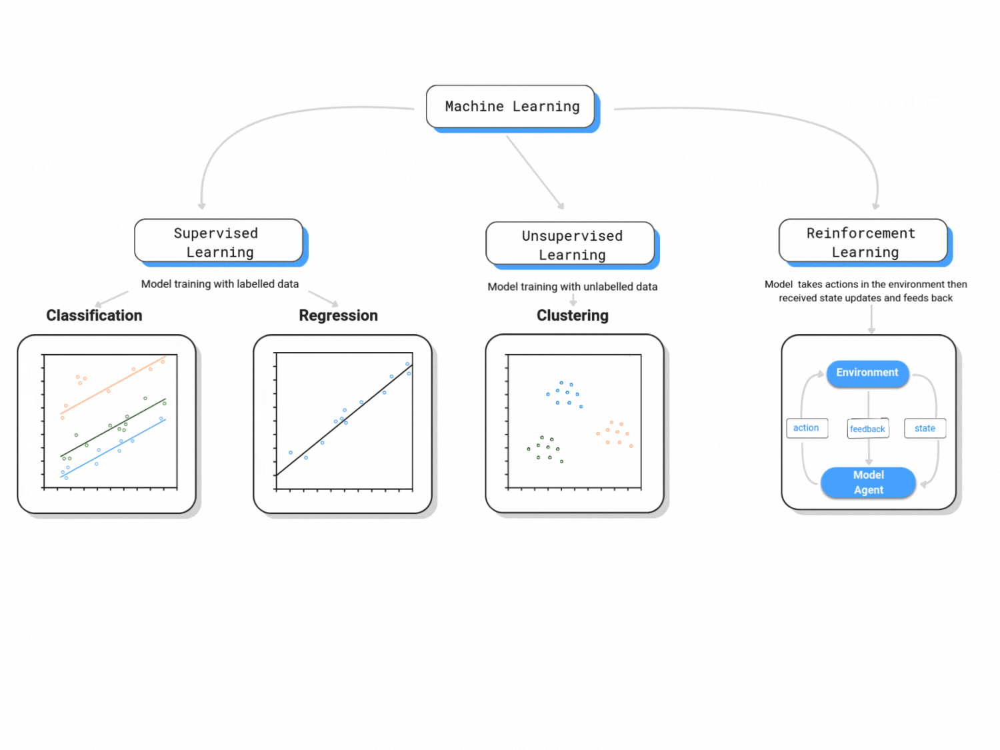

At its core, machine learning is primarily interested in making sense of complex data. A `machine learning` algorithm's job is to read data and identify patterns that can be used for: prediction, feature-relevance detection, model-free classification, among other actions.

## About this course

-   It is a (mostly) self-paced and fully online course.

-   We provide a non-exhaustive way to go about using the R and Python languages for basic Machine Learning purposes. Some of you may be able to optimize a few lines of code, and we encourage that!

-   The content is introductory. However, if it is a good stepping stone for more advanced projects. We are happy to provide advice on how to move forward with learning content or project implementation if that is the case.

- Every so often, we (the [coordinators](/about.qmd)) offer a guided and interactive version of this course. Feel free to reach out to us for more information on dates or specific use-cases via our [contact form](/contact.qmd) or email us at [machinelearning4publicpolicy@gmail.com](mailto:machinelearning4publicpolicy@gmail.com).

- We also host *collaborative* policy challenges, for which we encourage course participants from different fields to form groups and tackle societal challenges posed by an international organization using `machine learning` techniques. For more on this, check out the [policy challenge](/policy-challenge-2024.qmd) tab on our website.

## Quick Intro
### How does a Machine Learn?

Machine learning is classified in three major branches:

**1. Supervised Learning**:

This course is primarily concerned with supervised learning. Supervised learning is analogous to statistical learning: suppose that we observe a quantitative response $Y$ and $k$ predictors, $X_1, X_2,..., X_k$.

We can rewrite this in a general functional form as:

$$Y = f(X) + u$$ 

where $u$ is an error term.

:::{.callout-tip collapse="true"}
## A quick note
Note that we do impose linearity on the supervised learning fomulation.
:::

**2. Unsupervised Learning**:

Unsupervised learning is known for reading data without labels; it is more computationally complex than supervised learning (because it will look for all possible patterns in the data), but it is also more flexible than supervised learning. You can think of clustering, anomaly detection, neural networks, etc.

**3. Reinforcement Learning**:

Reinforcement learning is categorized as Artificial Intelligence. It is more focused on goal-directed learning from interaction than are other approaches to machine learning. As per [Sutton and Barto (2015)](https://web.stanford.edu/class/psych209/Readings/SuttonBartoIPRLBook2ndEd.pdf), the three most distinguishing features of reinforcement learning are:

1.  Being closed-loop; i.e. the learning system's actions influence its later inputs.

2.  Does not have direct instructions as to what actions to take; instead it must discover which actions yield the most reward by trying them out.

3.  Not knowing where the consequences of actions, including reward signals, play out over extended time periods.

::: {.content-visible when-format="html"}

:::

**Relevant trade-offs in Machine Learning**

-   Flexibility vs. interpretability: not all found patterns are directly interpretable.

-   Prediction vs. inference: high predictive power does not allow for proper inference.

-   Goodness-of-fit vs. over-fitting: how do we know *when* the fit is good?

## Next steps

Now is time to start programming! Choose your language, `R` or `Python` and follow the remainder of the course. If you have no experience with either (statistical) programming language, have a look at our crash intros! $\rightarrow$

[An introduction to R programming](r-intro.qmd)

[An introduction to Python programming](python-intro.qmd)