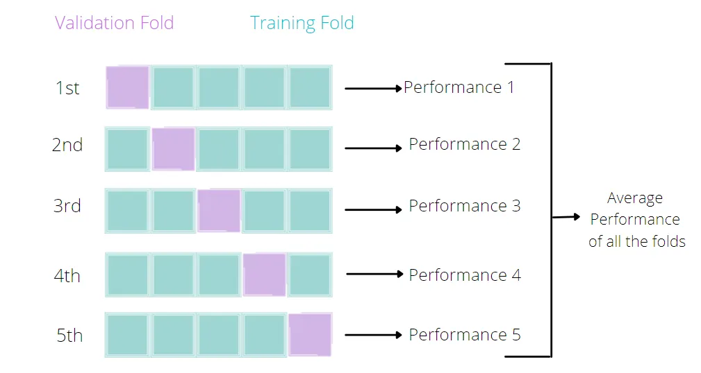

```{r, echo=FALSE}
#| echo: false
library(reticulate)

use_miniconda("/Users/lucas/Library/r-miniconda-arm64", required = TRUE)
```

**This section will cover:**

  - Introduction to Lasso
  
  - Cross-validation
  
  - Pipelines
  
 <br>

## Lasso linear regression

An OLS regression is not the only model that can be written in linear form:

$$
Y = \alpha + \beta_1 X_1 + \beta_2 X_2 \cdots \beta_k X_k + \epsilon
$$

Or in compact form:

$$
Y_i = \alpha + \sum_{j=1}^k \beta_j X_{ij} + \epsilon_i, \qquad i=1,\dots,n.
$$

Where we estimate:

$$
(\hat{\alpha}, \hat{\boldsymbol{\beta}})
= \arg\min_{\alpha,\boldsymbol{\beta}}
\left\{
\sum_{i=1}^n \left( Y_i - \alpha - \sum_{j=1}^k \beta_j X_{ij} \right)^2
\right\}.
$$

:::{.callout-important icon="true" appearance="simple"}
Linear models (OLS) minimize squared error loss.
:::

In this section we will discuss 'penalized' models, which can also be expressed as a linear relationship between parameters. Penalized regression models are also known as regression shrinkage methods, and they take their name after the colloquial term for coefficient regularization, 'shrinkage' of estimated coefficients. The goal of penalized models, as opposed to a traditional linear model, is not to minimize bias (least squares approach), but to reduce variance by adding a constraint to the equation and effectively pushing coefficient parameters towards $0$. This results in worse model predictors having a coefficient closer to zero (`ridge`) or even exactly zero (`lasso`), leaving us with only relevant predictors. In this session we will focus specifically on lasso models, which can penalize a coefficient all the way to zero!

**Linear model + penalization parameter**

$$
Y_i = \alpha + \sum_{j=1}^k \beta_j X_{ij} + \epsilon_i, \qquad i=1,\dots,n.
$$

Where we estimate:

$$
(\hat{\alpha}, \hat{\bm{\beta}})
= \arg\min_{\alpha,\bm{\beta}}
\left\{
\sum_{i=1}^n \left( Y_i - \alpha - \sum_{j=1}^k \beta_j X_{ij} \right)^2
\;+\; \lambda \sum_{j=1}^k \lvert \beta_j \rvert
\right\}.
$$

:::{.callout-important icon="true" appearance="simple"}
Lasso minimizes squared error loss + penalty term ($\lambda$).
:::

The equation above shows that the penalty is proportional to the **absolute** size of each coefficient. Larger coefficients (in absolute terms) receive larger penalties, while smaller coefficients receive smaller penalties. This penalty pushes coefficients toward zero, effectively reducing the number of active predictors in the model and thus reducing the risk of overfitting it.The penalty term is added to the loss function, and the goal is to minimize both the prediction error and the penalty together. 

However, there's a caveat to all this. Coefficient magnitudes naturally differ based on the scales of variables. For example, a variable measured in dollars might have coefficients in the hundreds, while a variable measured as a proportion might have coefficients less than 1. Without standardization, Lasso would disproportionately penalize the dollar variable simply because of its scale. This is why we standardize all predictors before applying Lasso. Standardization (centering and scaling) ensures all variables are on the same scale, making the penalty fair across all coefficients. Two important consequences of this: 

- The intercept becomes zero (since all variables are centered), and...

- We can meaningfully compare the relative importance of coefficients after shrinkage.

Consider a scenario where you have hundreds of predictors. Which predictors are truly important for our known outcome? Including all of the predictors leads to over-fitting. We'll find that the $R^2$ value is high in our training data, and conclude that our in-sample fit is good. However, this may lead to bad out-of-sample predictions. Model selection is a particularly challenging endeavor when we encounter high-dimensional data; i.e. when the number of variables is close to or larger than the number of observations. Some examples where you may encounter high-dimensional data include:

   - Cross-country analyses: we have a small and finite number of countries, but we may collect/observe as many variables as we want.

   - Cluster-population analyses: we wish to understand the outcome of some unique population

The lasso -Least Absolute Shrinkage and Selection Operator- imposes a shrinking penalty on the predictors, and reduces the size of the estimated coefficients towards and including zero (when the tuning parameter, or shrinkage penalty, is sufficiently large). The penalty term is called the L1-norm, and it corresponds to the sum of the absolute coefficients. Throughout this text, we have and will refer to the lasso penalty as lambda, L1-norm, and alpha. 

:::{.callout-caution}
# Terminology matters

- **L1-norm:** The L1 norm of a vector of coefficients $\beta$ is:
$$
\|\beta\|_{1} = \sum_{j=1}^{p} |\beta_{j}|
$$
and it is the mathematical quantity being penalized in lasso.

- **Lambda ($\lambda$):** In the optimization problem, the penalty strength is controlled by a parameter usually written as $\lambda$: 

  $$
  \min \; \frac{1}{2n} \|y - X\beta\|_{2}^{2} + \lambda \|\beta\|_{1}
  $$

  - Larger $\lambda \rightarrow$ stronger shrinkage $\rightarrow$ more coefficients pushed to zero.

  - Smaller $\lambda \rightarrow$ weaker penalty $\rightarrow$ model closer to OLS.

- **Alpha ($\alpha$):** The meaning of alpha depends on the software/package you're using: 
  - `sci-kit learn` (Python 🐍): `alpha` = $\lambda$ = penalty strength.

  - `glmnet` (R): `alpha`is a mixing parameter between Ridge and Lasso in Elastic Net: 
    - `alpha` = 1 $\rightarrow$ pure Lasso
    - `alpha` = 0 $\rightarrow$ pure Ridge
    - 0 < `alpha` < 1 $\rightarrow$ Elastic Net

*Note: In `glmnet` it is therefore a mixing parameter between the L1 and L2-norm penalties. More on that in a textbook.* 

:::

What does this mean for our case? Our malawi (.dta, .rds, .pkl) dataset includes lots of variables. You can subset the dataset with critical reasoning: using your knowledge of the phenomenon, which features might best describe it? But even then, we might still end up with a large number of features. Perhaps a lasso approach could work here.

Let's run a lasso regression and see if my statement holds. How would I know if it holds? If the Lasso regression returns the same values for the performance assessment parameters as the OLS regression; this means that the penalization parameter was either zero (leading back to an OLS) or too small to make a difference.

:::{.panel-tabset group="language"}

## R

### Preliminaries

Don't forget to load your libraries and set your working directory!

```{r}
#| message: false
#| warning: false

# Libraries for data-wrangling
library(tidyverse)   # Collection of packages for data manipulation and visualization
library(skimr)       # Quick data profiling and summary statistics
library(haven)       # Import foreign statistical formats into R
library(fastDummies) # Convert variables into binary (dummy variables) fastly

# Libraries for data analysis and visualization
library(corrplot)     # Correlation matrix visualization
library(modelsummary) # Model output summarization and tables
library(gt)           # Table formatting and presentation
library(stargazer)    # Statistical model output visualization

# Machine Learning library
library(caret)        # Machine learning functions and model training
library(glmnet)       # Lasso and ridge regression
library(Metrics)      # Model performance metrics
```

```{r}
#| echo: true
#| output: true

# Load the data and fix data types for compatibility
# Recall that we created these files in our last session!

# Load raw data
X_train_raw <- readRDS("Train_df.rds")  
X_test_raw <- readRDS("Test_df.rds")   
y_train_raw <- readRDS("Train_target.rds") 
y_test_raw <- readRDS("Test_target.rds") 
df_raw <- readRDS("malawi.rds") 

# Keep X_train and X_test as factors (as the linear model expects)
# but ensure target variable is numeric
X_train <- X_train_raw
X_test <- X_test_raw

# Extract target variable (rexpaggpc) as numeric vectors
y_train <- as.numeric(y_train_raw$rexpaggpc)
y_test <- as.numeric(y_test_raw$rexpaggpc)

# Create numeric versions for Lasso (pkg glmnet needs numeric matrices)
X_train_numeric <- data.frame(lapply(X_train_raw, function(x) {
  if(is.factor(x)) as.numeric(as.character(x)) else as.numeric(x)
}))
X_test_numeric <- data.frame(lapply(X_test_raw, function(x) {
  if(is.factor(x)) as.numeric(as.character(x)) else as.numeric(x)
}))

# For plotting, we'll use the numeric version
df <- X_train_numeric

# Load the OLS model
linear_model <- readRDS("linear_model.rds")

# Verify data types
cat("Data type verification:\n")
skim(X_train) |>
  summary()

cat("X_train_numeric (for Lasso): ", class(X_train_numeric)," with ", ncol(X_train_numeric), " columns (all numeric: ", all(sapply(X_train_numeric, is.numeric)), ")\n") 

cat("y_train: ", class(y_train), " with length ", length(y_train), "\n")
```

### Recap of OLS regression results

Once the data has been loaded, we should have a look at our past work:

```{r}
#| echo: true
#| output: true

# Predict y(target) values based on the test data model, with model trained on
y_pred <- as.numeric(predict(linear_model, X_test))
y_pred_train <- as.numeric(predict(linear_model, X_train))

# In summary, train and test prediction quality of the model
cat("Root mean squared error on training set:", sprintf("%.2f", rmse(y_train, y_pred_train)), "\n")
cat("R2 on training set:", sprintf("%.2f", cor(y_train, y_pred_train)^2), "\n")

cat("Root mean squared error on test set:", sprintf("%.2f", rmse(y_test, y_pred)), "\n")
cat("R2 on test set:", sprintf("%.2f", cor(y_test, y_pred)^2), "\n")
```

```{r}
#| echo: true
#| output: true


# Plot coefficients (feature importance)
plot_feature_importances <- function(model) {
  # Extract coefficients from the model
  coefs <- coef(model)
  
  # Create data frame for plotting
  coef_data <- data.frame(
    feature = names(coefs)[-1],  # Remove intercept
    coefficient = coefs[-1]      # Remove intercept
  )
  
  # Create horizontal bar plot
  p <- coef_data %>%
    ggplot(aes(x = coefficient, y = reorder(feature, coefficient))) +
    geom_col(fill = "cornflowerblue", alpha = 0.7) +
    labs(
      x = "Coefficient",
      y = "Feature", 
      title = "Feature Importance"
    ) +
    theme_minimal() +
    theme(
      axis.text.y = element_text(size = 6),
      plot.title = element_text(hjust = 0.5)
    )
  
  print(p)
}

plot_feature_importances(linear_model)
```

### Lasso

Let's start with a simple example. We'll use the same predictors as in the previous session. Instead of OLS, we will use a Lasso regression. The lambda ($\lambda$) coefficient is the penalty term. The higher the lambda, the more penalization we apply to the coefficients. We will start with a very high value of $10000$. This means that we are applying a very strong penalty to the coefficients. The model will thus strongly reduce the coefficients.

```{r}
# Convert numeric data to matrix format (required by glmnet)
X_train_matrix <- as.matrix(X_train_numeric)
X_test_matrix <- as.matrix(X_test_numeric)

# Fit Lasso regression with lambda=10000 (note: glmnet uses lambda, sklearn uses alpha)
# Need to standardize=FALSE as we want to control this ourselves
lasso_model <- glmnet(X_train_matrix, y_train, alpha=1, lambda=10000, standardize=FALSE)
```

```{r}
#| echo: true
#| output: true

# Let's use the model to predict the target variable
results_overview_r <- function(model, lambda_val) {
  # Make predictions and ensure they are numeric vectors
  y_pred <- as.numeric(predict(model, X_test_matrix, s=lambda_val))
  y_pred_train <- as.numeric(predict(model, X_train_matrix, s=lambda_val))
  
  # Calculate metrics
  cat("Root mean squared error on training set:", sprintf("%.2f", rmse(y_train, y_pred_train)), "\n")
  cat("R2 on training set:", sprintf("%.2f", cor(y_train, y_pred_train)^2), "\n")
  
  cat("Root mean squared error on test set:", sprintf("%.2f", rmse(y_test, y_pred)), "\n")
  cat("R2 on test set:", sprintf("%.2f", cor(y_test, y_pred)^2), "\n")
}

results_overview_r(lasso_model, 10000)
```

```{r}
#| echo: true
#| output: true

# Let's visualize the coefficients for Lasso
plot_feature_importances_lasso <- function(model, lambda_val) {
  # Extract coefficients at specific lambda
  coefs <- coef(model, s=lambda_val)
  coefs <- as.matrix(coefs)
  
  # Create data frame for plotting (exclude intercept)
  coef_data <- data.frame(
    feature = rownames(coefs)[-1],  # Remove intercept
    coefficient = coefs[-1,1]       # Remove intercept
  )
  
  # Create horizontal bar plot
  p <- coef_data %>%
    ggplot(aes(x = coefficient, y = reorder(feature, coefficient))) +
    geom_col(fill = "tomato", alpha = 0.7) +
    labs(
      x = "Coefficient",
      y = "Feature", 
      title = "Lasso Feature Importance"
    ) +
    theme_minimal() +
    theme(
      axis.text.y = element_text(size = 6),
      plot.title = element_text(hjust = 0.5)
    )
  
  print(p)
}

plot_feature_importances_lasso(lasso_model, 10000)
```

The coefficients are quite different: The lasso model has shrunk many coefficients towards zero. the model only has 21 coefficients > 0 out of 65 predictors that were included in the model. The two most important predictors are adulteq (a measure of the household's size; negative coefficient) and the existence of a flush toilet with a septic tank (positive coefficient).

The overall performance is also different from the OLS estimates: both R^2 and RMSE of the lasso model are worse than the OLS model. This applies to the training and test data. From these results we can conclude that our first lasso model does not outperform a simple OLS model. However, this was for lambda = 10000, a very large penalty term. Let's search for the optimal lambda value.

### Cross Validation -- how to find the best lambda?

Can we fine-tune model parameters? The quick answer is yes! Every ml algorithm has a set of parameters that can be adjusted/fine-tuned to improve our estimations. Even in the case of a simple linear model, we can try our hand at fine-tuning with, for example, cross-validation.

#### What is cross-validation?

Broadly speaking, it is a technique that allows us to assess the performance of our machine learning model. How so? Well, it looks at the 'stability' of the model. It's a measure of how well our model would work on new, unseen data (is this ringing a bell yet?); i.e. it has correctly observed and recorded the patterns in the data and has not captured too much noise (what we know as the error term, or what we are unable to explain with our model). $k$-fold cross-validation is a good place to start for such a thing. In the words of The Internet™, what k-fold cross validation does is:

Split the input dataset into $k$ groups

    - For each group:

        - Take one group as the reserve or test data set.

        - Use remaining groups as the training dataset.

        - Fit the model on the training set and evaluate the performance of the model using the test set.

TL;DR We're improving our splitting technique (re: train/test datasets)!



```{r}
# Use Lasso with cross-validation to find the best lambda
# cv.glmnet performs k-fold cross-validation for glmnet
set.seed(1234)  # For reproducibility
lassocv_model <- cv.glmnet(X_train_matrix, y_train,
   alpha=1, 
   lambda=c(0.1, 1, 10, 100, 1000), 
   nfolds=5, 
   standardize=FALSE)

# alpha = L1-norm, tells glmnet package that we are estimating a lasso model, use 0 for ridge, and anything in between for elastic net                           
```

```{r}
#| echo: true
#| output: true
#| 
# Out of the 5 lambdas, which performed best?
cat("Best lambda:", lassocv_model$lambda.min, "\n")
```

```{r}
#| echo: true
#| output: true

# Use the cross-validated model to get results
results_overview_r(lassocv_model$glmnet.fit, lassocv_model$lambda.min)
```

```{r}
#| echo: true
#| output: true

# Plot feature importances for cross-validated Lasso
plot_feature_importances_lasso(lassocv_model$glmnet.fit, lassocv_model$lambda.min)
```

The results above use the mean of the Mean Squared Error performance across the 5 folds to select the "best" model. We can also inspect the performance by lambda value.

```{r}
#| echo: true
#| output: true

# Let's access the cross-validation results and examine consistency across folds
# Note: cv.glmnet doesn't store individual fold MSEs like Python's LassoCV

# Show the first few lambda values to demonstrate the concept
n_show <- 5
for (i in 1:min(n_show, length(lassocv_model$lambda))) {
  mean_error <- lassocv_model$cvm[i]
  std_error <- lassocv_model$cvsd[i]
  
  # Calculate coefficient of variation: how variable is performance relative to the mean?
  coeff_of_variation <- (std_error / mean_error) * 100
  
  cat(sprintf("Lambda: %.6f\n", lassocv_model$lambda[i]))
  cat(sprintf("  Mean cross-validation error: %.6f\n", mean_error))
  cat(sprintf("  Standard error: %.6f\n", std_error))
  cat(sprintf("  Coefficient of variation: %.1f%%\n", coeff_of_variation))
  cat(sprintf("  Typical range across folds: [%.6f, %.6f]\n", 
              mean_error - std_error, mean_error + std_error))
  cat("\n")
}
```

**Why coefficient of variation matters for policy:** The coefficient of variation tells us how much performance varies across folds relative to the average. A high coefficient suggests the model performs very differently on different subsets of data. In high-stakes applications like emergency food assistance, this could mean the model systematically fails for certain vulnerable populations while working well for others.

As the means may hide large variation across the folds, understanding this consistency is crucial. High risk applications often prefer models with lower but more consistent performance over models with higher average performance but high variability across different groups.

**Policy Example:** 

:::{.callout-note icon="false"}
# Emergency Food Assistance During Drought Targeting
Consider a policy scenario where the government needs to rapidly identify households for emergency food assistance during a drought. In this high-risk application:

- **High average performance but high variance** could mean the model works well overall but systematically fails for certain subgroups (e.g. pastoralist communities, female-headed households, or households in some minority regions).

- **Consistency matters:** If the model has poor performance on one fold that captures, say, households in arid regions, those families could face malnutrition or starvation while other areas receive adequate support. Unlike a general development or social protection program where small targeting errors can be corrected over time, emergency assistance has immediate life-or-death consequences. A model that works 85% of the time on average, but only 60% of the time for certain vulnerable groups could lead to preventable deaths. 

- **Preference for lower variance:** Policymakers might prefer a model with 80% accuracy consistently across all folds rather than one with 85% average accuracy but ranging from 60-95% across different validation folds. 
:::

In this example, we have tested multiple lambda values using 5-fold cross validation. By default, we used the Mean Squared Error (MSE) to select our preferred specification. We could have also selected another metric such as the R^2. We'll cover the selection of performance metrics in more detail in the next session.

### Model Pipeline

In most applications we must apply a number of steps to our data before we can fit a model. For example, we need to standardise the data, select the features, and then fit many model specifications to search for the best set of parameters. We can do this in a single step using a pipeline. A pipeline is a way to streamline a series of data processing steps into a single object. This is particularly useful when we want to apply the same steps to both the training and test datasets.

In the previous code example we have used cross-validation to fine-tune the model parameters. The only parameter we changed was the lambda value. In other settings and with other estimators, we may want to change other parameters as well. For example, the way we standardize the data, the way we select the features, or we wish to fine tune with multiple parameters at once.

The latter is often called hyperparameter tuning. Hyperparameters are parameters that are not learned from the data, but are set before the learning process begins, such as the lambda value. The space of parameter values can be very large, growing exponentially with every additional hyperparameter we wish to tune. A grid search approach is a common way to search through the hyperparameter space. It is a brute-force approach that tries every combination of hyperparameters in the specified grid. The grid search will then return the best combination of hyperparameters based on the performance metric we specify. We'll test it below to see how it works, and will use variants of it in the next session when we start to implement more complex models.

In the example below, we will create a pipeline that includes the following steps:

1. Polynomial feature generation
2. Standardization of the data
3. Lasso regression
4. Grid search for hyperparameter tuning

```{r}
# R uses caret for pipeline-like functionality and grid search
# Additional library for polynomial features
library(recipes)  # For data preprocessing recipes including polynomial features
```

```{r}
# Define parameter grid for caret

lambda_vals <- seq(0.1, 50, length.out=25)  # Lambda values for glmnet

# Create parameter grid
# Note: glmnet only accepts 'alpha' and 'lambda' as tuning parameters
# Polynomial features and interactions are handled in the preprocessing "recipe"
tune_grid <- expand.grid(
  alpha = 1,  # For Lasso (alpha=1 in glmnet)
  lambda = lambda_vals
)
```

```{r}
# Define preprocessing recipe (equivalent to pipeline)
# For simplicity, we'll focus on the core Lasso with standardization
# Polynomial features can be added using step_poly() if needed

# Combine numeric training data with target for caret first
train_data <- data.frame(X_train_numeric, y = y_train)

# Create a recipe for preprocessing using numeric data
data_recipe <- recipe(y ~ ., data = train_data) |>
  # step_poly(all_predictors(), degree = 2) |>      # Add polynomial features (degree 2 = squared terms)
  # step_interact(~ all_predictors():all_predictors()) |>  # Add all pairwise interactions  
  step_normalize(all_predictors())  # Standardize all predictors (should be last step)

# Set up train control for cross-validation
train_control <- trainControl(
  method = "cv",
  number = 8,
  savePredictions = "final"
)
```

```{r}
#| output: false
# Fit the model with grid search
set.seed(1234)  # For reproducibility
grid_search_lasso_r <- train(
  data_recipe,
  data = train_data,
  method = "glmnet",
  trControl = train_control,
  tuneGrid = tune_grid
)
```

:::{.callout-warning}
Notice that R returns several warning messages: 5 variables from our dataset have zero variance, and were therefore not scaled. It is probably a good idea to follow the suggestion and remove them from the dataset altogether.
:::

Through the grid search we test all possible model specifications in the parameter space selected above. It will return the "best" model, i.e. the model with the lowest MSE. This is the default metric and we could optimize for other indicators such as R^2 or RMSE as well.

As we fit 40 different models, executing the code might take some time. If it takes too long on your machine, you can reduce the parameter space.

```{r}
#| echo: true
#| output: false

# Let's have a look at the best parameter combination
print(grid_search_lasso_r$bestTune)
print(grid_search_lasso_r$finalModel)
```

Best Tune:

|     | alpha | lambda |
|-----|-------|--------|
| 25  |   1   |   50   |

- alpha = 1 --> fixed for lasso
- lambda = 50 --> best lambda value (where before we had settled for 100, given a smaller grid search of possible lambda values)

- 25: of the 25 values explored, the values we select are on row 25 (lambda 50)

Final Model:

|     | Df     | %Dev  | Lambda|
|-----|-------|--------|-------|
| 1   |   0   | 0.00   | 138400|
| ... | ...   | ...    | ...   |
| 89  |   73  | 47.27  | 39    |

How to read the output for the final model print:

- **Df:** Degrees of freedom = Number of non-zero coefficients (features selected)

- **%Dev:** Percent deviance explained (much like r^2, the higher the number, the better)

- **Lambda:** Regularization strength (higher = more regulalization!)

What we see from the output-  

**As lambda increases:**

  - more features enter the model (Df increases)
  - model explains more variance (%Dev increases)
  - selected model (lambda = from the grid search above): have a look at the highest %Dev region (~47.27), and match that to 73 features (stable number), you'll notice that lambda is around 50.


```{r}
#| echo: true
#| output: true

# Let's have a look at the results
# Create test data for predictions using numeric data
test_data <- data.frame(X_test_numeric)

# Make predictions and ensure they are numeric
y_pred_final <- as.numeric(predict(grid_search_lasso_r, newdata = test_data))
y_pred_train_final <- as.numeric(predict(grid_search_lasso_r, newdata = data.frame(X_train_numeric)))

# Display results
cat("Root mean squared error on training set:", sprintf("%.2f", rmse(y_train, y_pred_train_final)), "\n")
cat("R2 on training set:", sprintf("%.2f", cor(y_train, y_pred_train_final)^2), "\n")

cat("Root mean squared error on test set:", sprintf("%.2f", rmse(y_test, y_pred_final)), "\n")
cat("R2 on test set:", sprintf("%.2f", cor(y_test, y_pred_final)^2), "\n")
```

```{r}
#| echo: true
#| output: true


# Plot feature importance for the final grid search model
# Extract the best model's coefficients
best_coefs <- coef(grid_search_lasso_r$finalModel, s = grid_search_lasso_r$bestTune$lambda)
best_coefs <- as.matrix(best_coefs)

# Create data frame for plotting (exclude intercept)
coef_data_final <- data.frame(
  feature = rownames(best_coefs)[-1],  # Remove intercept
  coefficient = best_coefs[-1,1]       # Remove intercept
)

# Create horizontal bar plot
p_final <- coef_data_final %>%
  ggplot(aes(x = coefficient, y = reorder(feature, coefficient))) +
  geom_col(fill = "forestgreen", alpha = 0.7) +
  labs(
    x = "Coefficient",
    y = "Feature", 
    title = "Grid Search Lasso Feature Importance"
  ) +
  theme_minimal() +
  theme(
    axis.text.y = element_text(size = 6),
    plot.title = element_text(hjust = 0.5)
  )

print(p_final)
```

The model performance has improved, but only marginally. However, there are still many aspects to improve the model. Here a few suggestions you can try out on your own:

   1. We have developed a data pipeline to process the data and to fit the model. We used a standard scaler to standardize the data, which, for binary data, might not be the best option. Maybe you could try other scalers? (Google it!) Similarly, instead of using polynomial degrees and interaction of all variables (try this on your own), you could focus on specific variables, numerical predictors for instance.

   3. In addition, we could test different model specifications such as Ridge regression or Elastic Net. These regularization models work in a similar way to Lasso but use a slightly different penalization approach. It is a good idea to try different model specifications and compare their performance.

   4.  We have a setup with multiple categorical variables which can be problematic with Lasso. Lasso models do not perform well with multiple categorical variables. As is our case. Primarily because, in order to work with categorical data in lasso models we encode them as dummies (for example, north = 1, else = 0). Lasso will thus only consider the dummy, and not the concept of the 'region'). An alternative to that is a Group Lasso. If you'd like to read more on that, you can read this [Stack Exchange discussion](https://stats.stackexchange.com/questions/214325/why-use-group-lasso-instead-of-lasso) or refer to this [Toward Data Science](https://towardsdatascience.com/beyond-linear-regression-467a7fc3bafb/) blog post.

## Python

### Preliminaries

Don't forget to load your libraries and set your working directory!

```{python}
#| echo: false
#| label: python-global-setup

# Global Python setup - ensures all libraries are available for entire session
import pandas as pd
import numpy as np
import os
import matplotlib.pyplot as plt
import seaborn as sns
import pickle
from sklearn.metrics import root_mean_squared_error, r2_score, mean_squared_error
from sklearn.preprocessing import StandardScaler
from sklearn.linear_model import Lasso, LassoCV
from sklearn.pipeline import Pipeline
from sklearn.preprocessing import PolynomialFeatures
from sklearn.model_selection import GridSearchCV

```

```{python}
#| echo: true
#| output: true

# Ensure imports are available in this chunk
import pickle
import pandas as pd
import numpy as np
from sklearn.metrics import root_mean_squared_error, r2_score

#let's open the data

# Load the data frames
with open('X_train.pkl', 'rb') as f:
    X_train = pickle.load(f)
with open('X_test.pkl', 'rb') as f:
    X_test = pickle.load(f)
with open('y_train.pkl', 'rb') as f:
    y_train = pickle.load(f)
with open('y_test.pkl', 'rb') as f:
    y_test = pickle.load(f)
with open('df.pkl', 'rb') as f:
    df = pickle.load(f)

# Load the OLS model
with open('linear_model.pkl', 'rb') as f:
    linear = pickle.load(f)
```

### Recap of OLS regression results

Once the data has been loaded, we should have a look at our past work:

```{python}
#| echo: true
#| output: true

# Ensure necessary imports
from sklearn.metrics import root_mean_squared_error, r2_score

#predict y(target) values based on the test data model, with model trained on
y_pred = linear.predict(X_test)
y_pred_train = linear.predict(X_train)

#in summary, train and test prediction quality of the model
print("Root mean squared error on training set: %.2f" % root_mean_squared_error(y_train, y_pred_train))
print("R2 on training set: %.2f" % r2_score(y_train, y_pred_train))

print("Root mean squared error on test set: %.2f" % root_mean_squared_error(y_test, y_pred))
print("R2 on test set: %.2f" % r2_score(y_test, y_pred))
```

```{python}
#| echo: true
#| output: true

# Libraries used in this chunk
import matplotlib.pyplot as plt
import numpy as np

#plot coefficients (feature importance)
def plot_feature_importances(model):
    # Set figure size to match YAML settings (6 width x 4 height)
    plt.figure(figsize=(6, 4))
    
    n_features=df.shape[1]
    plt.barh(np.arange(n_features), model.coef_, align='center', color='cornflowerblue', alpha=0.7)
    plt.yticks(np.arange(n_features), df.columns.values)
    #reduce y-axis font size
    plt.yticks(fontsize=6)
    plt.xlabel("coefficient")
    plt.ylabel("Feature")
    plt.ylim(-1, n_features)
    plt.title("Feature importance")
    plt.tight_layout()  # Helps reduce whitespace
    plt.show()
plot_feature_importances(linear)
```

### Lasso

Let's start with a simple example. We utilize the same predictors as in the previous session. Instead of OLS, we will use a Lasso regression. The alpha ($\alpha$) coefficient is the penalty term. The higher the alpha, the more penalization we apply to the coefficients. The default value is 1.0. We will start with a very high value of 10000. This means that we are applying a very strong penalty to the coefficients. The model will thus strongly reduce the coefficients.

```{python}
# Ensure necessary imports
from sklearn.linear_model import Lasso

lasso = Lasso(alpha=10000, max_iter=100000)
lasso.fit(X_train, y_train)
```

```{python}
#| output: true

#Let's use the model to predict the target variable
def results_overview(model):
    y_pred = model.predict(X_test)
    y_pred_train = model.predict(X_train)
    print("Root mean squared error on training set: %.2f" % root_mean_squared_error(y_train, y_pred_train))
    print("R2 on training set: %.2f" % r2_score(y_train, y_pred_train))

    print("Root mean squared error on test set: %.2f" % root_mean_squared_error(y_test, y_pred))
    print("R2 on test set: %.2f" % r2_score(y_test, y_pred))

results_overview(lasso)
```

```{python}
#| output: true

#let's visualize the coefficients
plot_feature_importances(lasso)
```

The coefficients are quite different: The lasso model has shrunk the coefficients towards zero. the model only has 21 coefficients > 0 out of 65 predictors that we included in the model. The two most important predictors are adulteq (a measure of the household's size; negative coefficient) and the existence of a flush toilet with a septic tank (positive coefficient).

The overall performance is also different from the OLS estimates: both R^2 and RMSE of the lasso model are worse than the OLS model. This applies to the training and test data. From these results we can conclude that our first lasso model does not outperform a simple OLS model. However, this was for alpha = 10000, a very large penalty term. Let's search for the optimal alpha value.

### Cross Validation -- how to find the best alpha?

Can we fine-tune model parameters? The quick answer is yes! Every algorithm has a set of parameters that can be adjusted/fine-tuned to improve our estimations. Even in the case of a simple linear model, we can try our hand at fine-tuning with, for example, cross-validation.

#### What is cross-validation?

Broadly speaking, it is a technique that allows us to assess the performance of our machine learning model. How so? Well, it looks at the 'stability' of the model. It's a measure of how well our model would work on new, unseen data (is this ringing a bell yet?); i.e. it has correctly observed and recorded the patterns in the data and has not captured too much noise (what we know as the error term, or what we are unable to explain with our model). $k$-fold cross-validation is a good place to start for such a thing. In the words of The Internet™, what k-fold cross validation does is:

Split the input dataset into $k$ groups

    - For each group:

        - Take one group as the reserve or test data set.

        - Use remaining groups as the training dataset.

        - Fit the model on the training set and evaluate the performance of the model using the test set.

TL;DR We're improving our splitting technique!


```{python}
#use lasso and cross-validation to find the best alpha
lassocv = LassoCV(alphas=[0.1, 1, 10, 100, 1000], cv=5, max_iter=100000, random_state=1234)
lassocv.fit(X_train, y_train)
```

```{python}
#| output: true

#sout of the 5 alphas, which performed best?
lassocv.alpha_
```

```{python}
#| output: true

results_overview(lassocv)
```

```{python}
#| output: true

plot_feature_importances(lassocv)
```

The results above use the mean of the Mean Squared Error performance across the 5 folds to select the "best" model. We can also inspect the performance in each fold separately.

```{python}
#| output: true

#let's access the cross-validation results
mse_path = lassocv.mse_path_
# Display performance metrics for each fold
alphas = lassocv.alphas_  # Alpha values used in the model
for i, alpha in enumerate(alphas):
    print(f"Alpha: {alpha}")
    for fold, mse in enumerate(mse_path[i]):
        print(f"  Fold {fold + 1}: MSE = {mse}")
    print()
```

As the means may hide large variation across the folds, we can additionally inspect the variance of the performance across the folds. There might be applications in which we do not wish to deploy a model that performs best on average, but that can have large performance variance. High risk applications in which we have a high preference to rule out low-performance folds could be an example. In our case, the differences in the performance variance are small.

**Policy Example:** 

:::{.callout-note icon="false"}
# Emergency Food Assistance During Drought Targeting
Consider a policy scenario where the government needs to rapidly identify households for emergency food assistance during a drought. In this high-risk application:

- **High average performance but high variance** could mean the model works well overall but systematically fails for certain subgroups (e.g. pastoralist communities, female-headed households, or households in some minority regions).

- **Consistency matters:** If the modelhas poor performance on one fold that captures, say, households in arid regions, those families could face malnutrution or starvation while other areas receive adequate support. Unlike a general development or social protection program where small targeting errors can be corrected over time, emergency assistance has immediate life-or-death consequences. A model that works 85% of the time on average, but only 60% of the time for certain vulnerable groups could lead to preventable deaths. 

- **Preference for lower variance:** Policymakers might prefer a model with 80% accuracy consistently across all folds rather than one with 85% average accuracy but ranging from 60-95% across different validation folds. 
:::

```{python}
#| output: true

#compute the variance in MSE across the 5 folds for each alpha value we tested
mse_variance = np.var(mse_path, axis=1)
# Display the variance for each alpha
for i, alpha in enumerate(alphas):
    print(f"Alpha: {alpha}, Variance in MSE: {mse_variance[i]}")
```

In this example, we have tested 5 different alpha values and compared them using 5-fold cross validation. By default, we used the Mean Squared Error (MSE) to select our preferred specification. We could have also selected another metric such as R2. We'll cover the selection of the performance metric in more detail in the next session.

### Model Pipeline

In most applications we must apply a number of steps to our data before we can fit a model. For example, we need to standardise the data, select the features, and then fit many model specifications to search for the best set of parameters. We can do this in a single step using a pipeline. A pipeline is a way to streamline a series of data processing steps into a single object. This is particularly useful when we want to apply the same steps to both the training and test data.

In the previous code example we have used cross-validation to fine-tune the model parameters. The only parameter we changed was the alpha value. In other settings and with other estimators, we may want to change other parameters as well. For example, the way we standardize the data, the way we select the features, or we wish to fine tune with multiple parameters.

The latter is often called hyperparameter tuning. Hyperparameters are parameters that are not learned from the data, but are set before the learning process begins, such as the alpha value. The space of parameter values can be very large, growing exponentially with every additional hyperparameter we wish to tune. A grid search approach is a common way to search through the hyperparameter space. It is a brute-force approach that tries every combination of hyperparameters in the specified grid. The grid search will then return the best combination of hyperparameters based on the performance metric we specify. We'll test it below to see how it works, and will use variants of it in the next session when we start to implement more complex models.

In the example below, we will create a pipeline that includes the following steps:

1. Polynomial feature generation
2. Standardization of the data
3. Lasso regression
4. Grid search for hyperparameter tuning


```{python}
interaction= [False, True] ##we test whether interacting variables is useful
degree = [1] ##  we can test whether adding squared features is useful. degree 2 for all vars takes very long
alpha = np.linspace(0.1, 50, num=25)
max_iter = [100000]

param_grid = {
    'poly__interaction_only': interaction,
    'poly__degree': degree,
    'linear__alpha': alpha,
    'linear__max_iter': max_iter,
    'linear__tol': [0.001],
}
```

```{python}
# Define pipeline
pipe = Pipeline([
    ("poly", PolynomialFeatures()),
    ("scaler", StandardScaler()),
    ("linear", Lasso(max_iter=10000, random_state=1234))
])

grid_search_lasso = GridSearchCV(pipe, param_grid, cv=8, return_train_score=True)
```

```{python}
# let's fit the model
grid_search_lasso.fit(X_train, y_train)
```

Through the grid search we test all possible model specifications in the parameter space selected above. It will return the "best" model, i.e. the model with the lowest MSE. This is the default metric and we could optimize for other indicators such as R2 or RMSE as well.

As we fit 40 different models, executing the code might take some time. If it takes too long on your machine, you can reduce the parameter space.

```{python}
#| output: true

#let's have a look at the best parameter combination
print(grid_search_lasso.best_estimator_)
```

```{python}
#| output: true

results_overview(grid_search_lasso)
```

```{python}
#| output: true

plot_feature_importances(lassocv)
```

The model performance has improved, but only marginally. However, there are still many aspects to improve the model. Here a few suggestions you can try out on your own:

   1. We have developed a data pipeline to process the data and to fit the model. We used a standard scaler to standardize the data, which, for binary data, might not be the best option. In addition, you could try other scalers. Similarly, instead of using polynomial degrees and interaction of all variables, you could focus on specific variables, numerical predictors for instance.

   2. In addition, we could test different model specifications such as Ridge regression or Elastic Net. These regularization models work in a similar way than LASSo but use a slightly different penalization approach. It is a good idea to try different model specifications and compare their performance.

   3.  We have a setup with multiple categorical variables which can be problematic with Lasso. Lasso models do not perform well with multiple categorical variables. As is our case. Primarily because, in order to work with categorical data in lasso models we encode them as dummies (for example, north = 1, else = 0). Lasso will thus only consider the dummy, and not the concept of the 'region'). An alternative to that is a Group Lasso. If you'd like to read more on that, you can read this [Stack Exchange discussion](https://stats.stackexchange.com/questions/214325/why-use-group-lasso-instead-of-lasso) or refer to this [Toward Data Science](https://towardsdatascience.com/beyond-linear-regression-467a7fc3bafb/) blog post.

:::

:::{.callout-tip}
# A final note 
There is some discussion over whether k-fold or really any cross-validation technique is optimal for choosing the lambda parameter in Lasso models (see for example, this [Coursera video](https://www.coursera.org/learn/ml-regression), or the TL;DR [Stack Exchange](https://stats.stackexchange.com/questions/353185/why-using-cross-validation-is-not-a-good-option-for-lasso-regression) post). We cannot give you a general answer to this question. Just make sure to make an informed choice of which `cv` technique you'll implement in your model.
:::